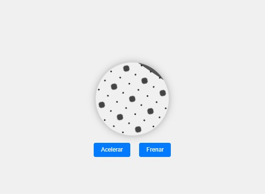

# Proyecto: Rin Moderno Interactivo

## Descripción
Aplicación web interactiva que simula un rin moderno en movimiento con controles para acelerar y frenar su rotación. Creada con HTML, CSS y JavaScript, esta herramienta permite visualizar de forma dinámica el comportamiento de un diseño de llanta contemporáneo.

## Características
- **Rin 3D Estilizado**: Diseño moderno con efectos degradados y patrones realistas
- **Controles Interactivos**:
  - Botón "Acelerar" (Aumenta la velocidad de rotación)
  - Botón "Frenar" (Reduce la velocidad de rotación)
- **Animaciones Suaves**: Transiciones fluidas con aceleración/desaceleración gradual
- **Diseño Responsivo**: Se adapta a diferentes tamaños de pantalla
- **Efectos Visuales**: Sombras y reflejos realistas en el diseño del rin
